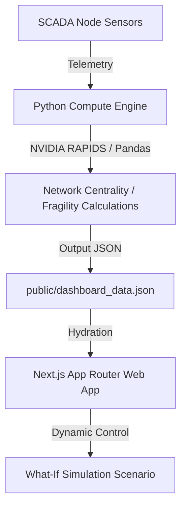

# PuneJal (पुणेजल)

**PuneJal** is an enterprise municipal water management and SCADA decision-support platform built for the **Pune Municipal Corporation (PMC)**. It provides real-time telemetry visualization, hydraulic network diagnostics, and policy simulation tools to optimize municipal water equity and manage resource crises.

---

## ⚡ Key Features

* **Basin Simulator**: Live storage tracking (Khadakwasla Basin), simulated monsoon inflows, turbidity forecasts, and zone rationing recommendations.
* **Network Diagnostics**: Ward Fragility Index calculations utilizing network graph centrality (critical pipelines, elevation gradients, burst risks).
* **Emergency Command Center**: Active rationing state overrides, dynamic water depletion telemetry, and an interactive **"What-If" Response Simulator** (e.g., Agricultural Allocation Cuts vs. System Lifespan).
* **Dual Compute Pipeline**: Dynamically executes hydraulic calculations using **NVIDIA RAPIDS (cuDF/cuGraph)** on GPU-enabled environments, automatically falling back to CPU (Pandas/NetworkX) on standard servers.

---

## 🏗️ Architecture



---

## 🚀 Getting Started

### 1. Prerequisites
* **Node.js**: `v20.x` or later
* **Python**: `v3.10.x` or later

### 2. Python Telemetry Pipeline
Set up the virtual environment and run the pipeline to generate ward SCADA telemetry data:
```bash
# Set up virtual environment
python3 -m venv .venv
source .venv/bin/activate

# Install dependencies
pip install pandas networkx

# Run telemetry pipeline (generates public/dashboard_data.json)
python punejal_rapids_starter.py
```

### 3. Next.js Dashboard
Install dependencies and launch the local development server:
```bash
npm install
npm run dev
```
Open [http://localhost:3000](http://localhost:3000) to view the platform.

---

## ☁️ Google Cloud Deployment (Cloud Run)

This repository is optimized for deployment to **Google Cloud Run** using a multi-stage `Dockerfile` and a custom `.gcloudignore` configuration.

### Deployment options

#### Option 1: Deploy from Google Cloud Shell (CLI)
Ensure you are inside the repository root (`/punejal-v3`) in Cloud Shell, then run:

```bash
# 1. Login with your Google account
gcloud auth login

# 2. Set your active project
gcloud config set project punejal

# 3. Deploy using Cloud Build directly from source
gcloud run deploy punejal-dashboard \
    --source . \
    --region us-central1 \
    --allow-unauthenticated \
    --port 8080
```

#### Option 2: Continuous Deployment via Git Repository (GCP Web UI)
1. Go to the **[Cloud Run Console](https://console.cloud.google.com/run?project=punejal)**.
2. Click **Create Service**.
3. Select **Continuously deploy from a git repository** and connect your GitHub repo `Deeptesha/punejal-v3`.
4. Choose **Dockerfile** as the build configuration.
5. Set the **Container Port** to `8080` and authentication to **Allow unauthenticated invocations**.
6. Click **Create** to deploy.

---

## 📦 Container Specifications

* **Base OS**: `Alpine Linux` (minimal, secure footprint)
* **Production Build**: Compiles to Next.js **Standalone Server** (`output: 'standalone'`) copying only required `node_modules`.
* **Port**: `8080`
* **Non-Root Access**: Runs under a dedicated `nextjs` system user group to adhere to security best practices.
